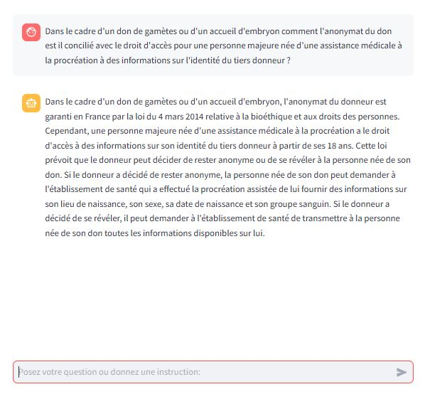
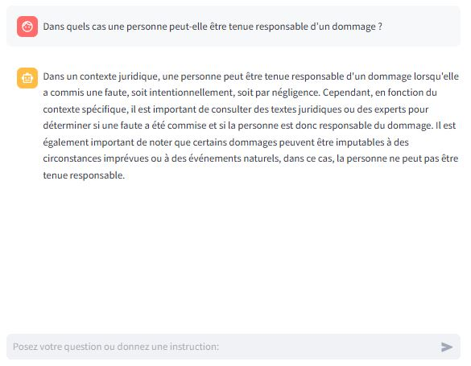
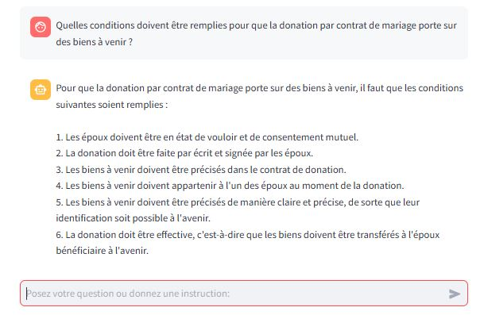

# Document-Assistant-Using-RAG

This project implements a chat application that uses a RAG system with the pre-trained **Mistral-7B** model and an interactive user interface built using **Streamlit**. The system focuses on French laws allowing users to ask questions and get clear accurate answers based on legal texts.


## Steps :

1. **Running the project** :
    Before starting, make  sure you have installed the required libraries using :
   
    ```bash
    pip install -r requirements.txt
    ```

2. **Set up your Hugging Face API key** :
    - Go to the [Hugging Face ](https://huggingface.co) website and log in to your account.
    - Click on your profile in the top right corner then navigate to **Settings -> Access Tokens** and generate a new API key

3. **Add the API key to the code** :
    Open the  `generation.py` file (stored under /scripts) and insert your API key in the designated place (line 7) :
    
    ```python
    api_key = 'INSERT_API_KEY'
    ```
4. **Running the project** :
    To start the application, run the following command in your terminal:
   
    ```bash
    streamlit run scripts/generation.py 
    ```
    or use docker 
     
    ```bash
    docker build -t app .
    ```
    and 

    ```bash
    docker run -p 8501:8501 app
    ```
    
    This will launch your browser and you'll be all set to start chatting with the bot about French laws!


## Concrete Examples of Chatbot Interaction

Below are three concrete examples showing how to interact with the chatbot :






---

